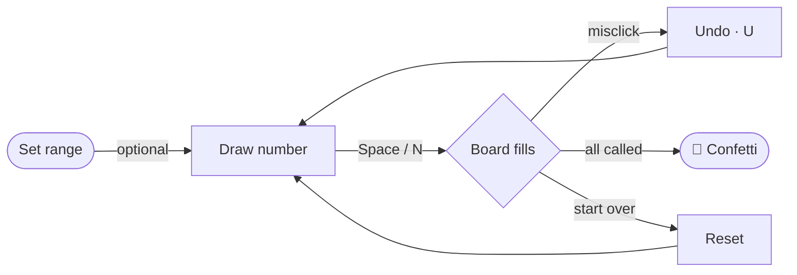
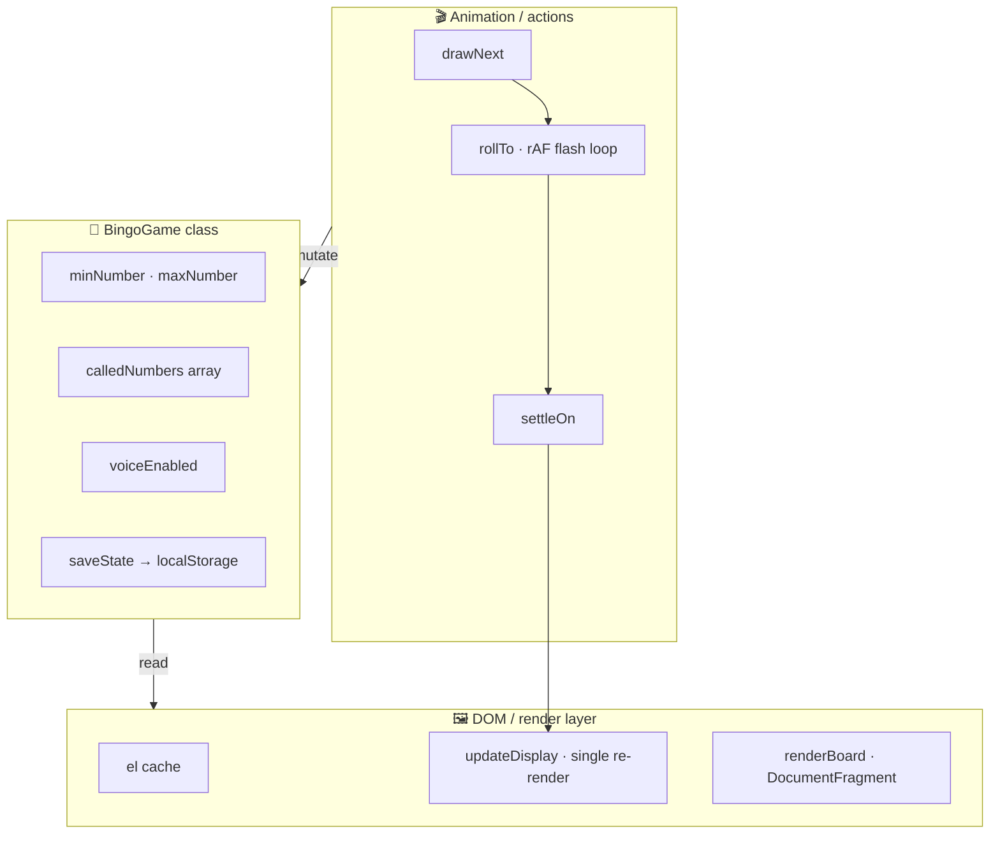

<div align="center">

# 🎰 DSL Bingo Game

### A single-file, zero-dependency bingo number caller that runs entirely in your browser.

Draw random numbers from a configurable range, track them on a live board, and never call the same number twice.

<br>


</div>

---

```
   ┌──────────────────────────────────────────────┐
   │   🎰  DSL BINGO            ☾ dark   ⚙ range   │
   ├──────────────────────────────────────────────┤
   │                                                │
   │        ╭────────╮            next             │
   │        │   42   │   ◀ draw    ╭────╮           │
   │        ╰────────╯             │ 17 │           │
   │                               ╰────╯           │
   │                                                │
   │   recent   ( 7 )( 91 )( 33 )( 5 )( 42 ) ◀ new  │
   ├──────────────────────────────────────────────┤
   │   Board  (5 / 91 called)      ↩ Undo  ⟳ Reset │
   │   [ 1 ][ 2 ][ 3 ][ 4 ][ 5●][ 6 ] ...           │
   └──────────────────────────────────────────────┘
```

## ✨ Features

| | Feature | What it does |
|---|---|---|
| 🎯 | **Configurable range** | Set any min/max (defaults `0–90`); board & totals update automatically |
| 🟢 | **Live board** | Every number renders; called ones light up, latest draw highlighted |
| 🎞️ | **Animated reveal** | Numbers roll before settling on the drawn value |
| 🔁 | **Recent-draws strip** | Full call history, newest emphasized |
| ↩️ | **Undo last call** | Correct a misclick without resetting the game |
| ⌨️ | **Keyboard shortcuts** | `Space`/`N` to draw, `U` to undo |
| 🔊 | **Voice announcements** | Optional — reads each number aloud via Web Speech API |
| 🌙 | **Dark mode** | Toggle in header; remembers choice + honors system preference |
| 🎉 | **Celebration** | Confetti when the final number is drawn |
| 💾 | **Auto-save** | State, range & prefs persist in `localStorage` |
| ♿ | **Accessible** | `aria-live` announcements + reduced-motion mode + responsive |

## 🚀 Getting Started

No installation. Pick one:

```bash
# Option A — just open it
open index.html

# Option B — serve the folder
python3 -m http.server 8000     # Python
npx serve .                     # or Node
# then visit http://localhost:8000
```

## 🎮 How to Play



1. *(Optional)* Click **Range** → set **Min** / **Max** → **Update Range & Reset**.
2. Press **Next Number** (or `Space` / `N`) to draw a random, not-yet-called number.
3. Watch the board fill — newest number marked green, recent draws in the strip.
4. **Undo Last** (or `U`) takes back an accidental draw.
5. **Reset Game** clears all called numbers.

> 🔊 Enable **Announce numbers aloud** in settings to have each draw spoken.

## ⌨️ Keyboard Shortcuts

| Key | Action |
| :---: | :--- |
| `Space` · `N` | Draw the next number |
| `U` | Undo the last draw |

## 🧩 Architecture

Three layers inside one `index.html`, kept deliberately separate:



- **`BingoGame`** owns all state; every mutation calls `saveState()`. Zero DOM knowledge.
- **Render layer** — `updateDisplay()` is the single re-render entry point.
- **Actions** — `drawNext → rollTo → settleOn`; a `rolling` flag guards concurrent draws.

**Persistence** — two `localStorage` keys, both try/catch wrapped so private mode degrades to in-memory:

| Key | Holds |
| --- | --- |
| `bingoGame` | Full game state (JSON), validated on load |
| `bingoTheme` | `'dark'` / `'light'`, applied via `data-theme` |

## 🛠️ Tech

Vanilla **HTML · CSS · JavaScript** in a single self-contained file. No build, no lint, no test tooling, no libraries, no network requests. Theming is pure CSS custom properties.

## 🌐 Browser Support

Works in all modern browsers (Chrome, Firefox, Safari, Edge). Voice announcements require Web Speech API support; everything else works everywhere.

<div align="center">
<br>

**Built by [Danphe Software Labs](https://github.com/cdrrazan)** · Vanilla web, no frameworks harmed 🦕

</div>
